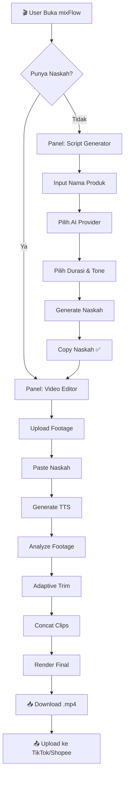
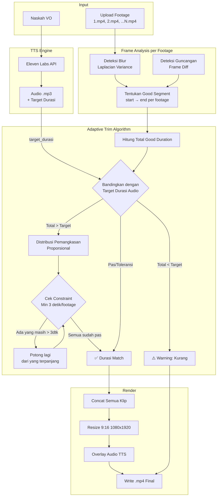
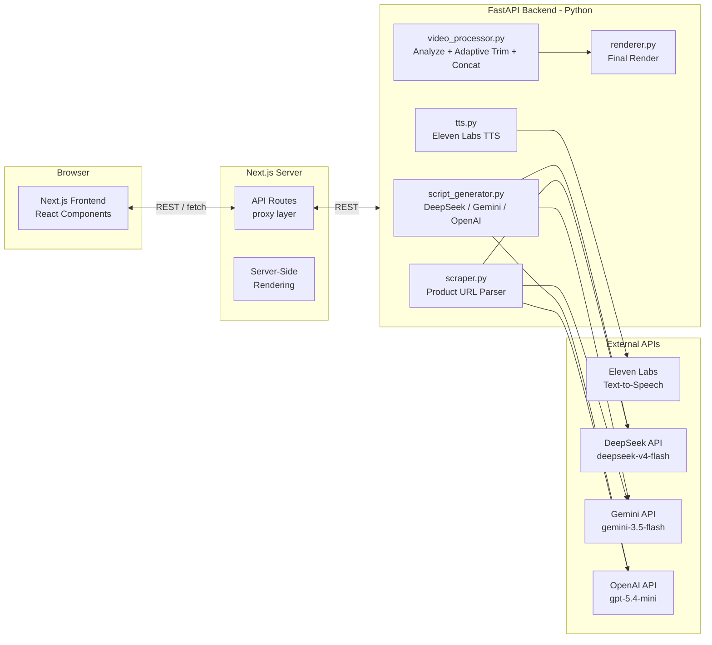
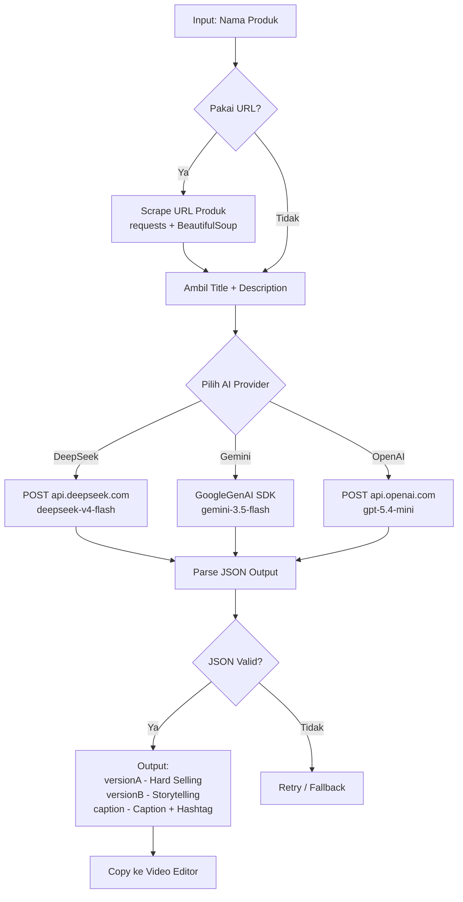

# 🚀 Product Requirements Document (PRD)

**Nama Proyek:** mixFlow  
**Jenis:** Web Application — Next.js (Frontend) + FastAPI (Backend)  
**Deskripsi:** Aplikasi all-in-one untuk content creator affiliate — menggabungkan AI Script Generator untuk membuat naskah video pendek (TikTok/Shopee) dengan Video Editor yang dilengkapi Text-to-Speech (Eleven Labs) dan adaptive trim otomatis.

---

## 1. Target Pengguna

Content creator affiliate di platform:
- TikTok Shop
- Shopee Video
- Shopee Live (short video)

## 2. Fitur Inti

### A. AI Script Generator (Panel 1)
Membuat naskah voice-over video pendek untuk promosi produk affiliate secara otomatis menggunakan AI.

| Fitur | Deskripsi |
|---|---|
| **Input Nama Produk** | User memasukkan nama produk yang akan dipromosikan |
| **Input URL Produk** _(opsional)_ | Scraping halaman produk untuk mendapatkan konteks (judul, deskripsi) |
| **Pilih AI Provider** | DeepSeek (`deepseek-v4-flash`), Google Gemini (`gemini-3.5-flash`), OpenAI (`gpt-5.4-mini`) |
| **Pilih Durasi Video** | 15 detik, 30 detik, 60 detik, 90 detik (mempengaruhi panjang naskah) |
| **Pilih Gaya Bahasa** | Casual & Menarik, Formal, Humor, dll |
| **Pilih Target Audiens** | Umum, Ibu Rumah Tangga, Gen Z, Milenial, dll |
| **Output** | JSON: `versionA` (Hard-Selling), `versionB` (Storytelling), `caption` |

**Aturan Konten Naskah** (hard-coded di system prompt):
- DILARANG menyebut nama marketplace (Shopee, Tokopedia, Lazada, TikTok Shop, dll)
- DILARANG menyebut nama media sosial (Instagram, IG, Facebook, FB, YouTube, YT, TikTok, X, Twitter, dll)
- DILARANG menggunakan "Klik link di bio!" atau "keranjang kuning"
- Gunakan CTA afiliator: "cek keranjang di bawah video ini" atau "klik tautan di bawah"
- Format paragraf pendek (2-3 kalimat per paragraf), dipecah sebagai array

### B. Video Editor (Panel Utama)
Menggabungkan footage video + voice-over TTS menjadi satu video short vertical siap upload.

| Fitur | Deskripsi |
|---|---|
| **Upload Footage** | Multi-file upload (.mp4, .mov, .avi), bisa drag & drop |
| **Auto-Analyze** | Deteksi blur (Laplacian variance) & guncangan (frame diff) per footage |
| **Adaptive Trim** | Potong otomatis bagian awal/akhir yang jelek, durasi menyesuaikan audio TTS |
| **TTS Generation** | Text-to-Speech via Eleven Labs API |
| **Concat + Render** | Gabung footage + overlay audio → output 9:16 (1080×1920) H.264 |

**Constraint Adaptive Trim:**
- Setiap footage minimal tersisa **3 detik** bagian bagus
- Pemangkasan proporsional: footage panjang kena pangkas lebih besar
- Total durasi video akhir ≈ durasi audio TTS

### C. Settings (Panel 3)
Konfigurasi API keys untuk semua layanan eksternal:

| Key | Layanan |
|---|---|
| `ELEVENLABS_API_KEY` | Text-to-Speech |
| `DEEPSEEK_API_KEY` | AI Script Generator (DeepSeek) |
| `GEMINI_API_KEY` | AI Script Generator (Google Gemini) |
| `OPENAI_API_KEY` | AI Script Generator (OpenAI) |
| `ELEVENLABS_VOICE_ID` | Voice default untuk TTS |
| `MIN_KEEP_DURATION` | Minimal durasi per footage (default: 3 detik) |

---

## 3. Diagram & Alur Kerja

### 3.1 Flow Utama Aplikasi



### 3.2 Detail Flow Adaptive Trim (Inti Video Editor)



### 3.3 Arsitektur Aplikasi (Next.js + FastAPI)



**Alur Komunikasi:**
1. **Next.js Frontend** ← tampilan UI (React components), semua interaksi user di sini
2. **Next.js API Routes** → proxy tipis yang meneruskan request ke FastAPI backend (menyembunyikan URL backend, handling CORS)
3. **FastAPI Backend** → semua heavy processing: video (moviepy/OpenCV), TTS (Eleven Labs), AI script generation, scraping
4. File upload: Frontend → FastAPI langsung (multipart/form-data), Next.js tidak ikut memproses file besar

### 3.4 Alur Script Generator



---

## 4. Tech Stack

### 4.1 Frontend (Next.js)

| Kategori | Teknologi | Alasan |
|---|---|---|
| **Framework** | Next.js 15 (App Router) | File-based routing, SSR/SSG, API Routes, deployment mudah (Vercel) |
| **UI Library** | React 19 | Komponen interaktif, state management, hooks |
| **Styling** | Tailwind CSS 4 | Utility-first, dark theme mudah, responsive mobile-first, mirip desain mockup |
| **State** | React Context + useReducer | API keys & session state, tidak butuh Redux untuk skala ini |
| **HTTP Client** | Fetch API native | Ringan, tidak perlu Axios untuk 1 backend |
| **File Upload** | `<input type="file">` + FormData | Upload footage langsung ke FastAPI backend |
| **Animasi** | CSS Transitions + framer-motion | Progress pipeline, toast, transisi panel |
| **Icons** | Lucide React / Emoji | Ikon ringan, konsisten |

**Catatan:** Tidak menggunakan Next.js API Routes untuk video processing — hanya sebagai proxy tipis untuk menyembunyikan URL backend. File upload footage langsung dari browser ke FastAPI (bypass Next.js) supaya tidak membebani server Node.js.

### 4.2 Backend (FastAPI — Python)

| Kategori | Teknologi | Alasan |
|---|---|---|
| **Framework** | FastAPI | Async support, auto OpenAPI docs, performa tinggi |
| **Video Processing** | moviepy + OpenCV | Industri standar untuk manipulasi video di Python |
| **Text-to-Speech** | Eleven Labs Python SDK | Official SDK, chunking teks panjang |
| **AI Script Gen** | HTTP REST calls (httpx) | DeepSeek API, Google GenAI SDK, OpenAI SDK |
| **Web Scraping** | requests + BeautifulSoup4 | Ringan, cukup untuk parse HTML produk |
| **Image Processing** | Pillow | Resize/crop frame |
| **Config/Env** | pydantic-settings + .env | Type-safe config, 12-factor app |
| **CORS** | fastapi.middleware.cors | Whitelist Next.js origin |

### 4.3 Mengapa Tidak Pakai Node.js Backend?

| Pertimbangan | Keputusan |
|---|---|
| **Video processing** | moviepy & OpenCV hanya ada di Python — tidak ada alternatif Node.js yang setara |
| **TTS SDK** | Eleven Labs Python SDK lebih mature dibanding JS SDK |
| **Ekosistem AI** | Python adalah first-class citizen untuk AI/ML library |
| **Kompleksitas** | Menambah Node.js backend = 3 runtime (Node + Python + Browser) tanpa manfaat jelas |
| **Kesimpulan** | ✅ **Skip Node.js backend** — Next.js (frontend) + FastAPI (backend) sudah cukup |

---

## 5. Arsitektur Frontend (Next.js)

### 5.1 Desain Referensi

Mockup layout tersedia di `contoh-layout/index.html` sebagai acuan visual:
- **Tema:** Dark mode penuh (background `#0a0a14`) — vibe video editor profesional
- **Aksen:** Gradient ungu (`#6c5ce7 → #a855f7`) untuk tombol primary, sidebar active state, glow effects
- **Layout:** Sidebar (desktop) / Bottom nav (mobile) + Topbar + Content area
- **Responsive:** 3 breakpoint — ≥1024px (desktop), ≤768px (tablet/mobile), ≤400px (small phone)
- **Mobile-first:** Sidebar berubah jadi hamburger drawer + bottom navigation bar di layar kecil
- **Touch-friendly:** Minimum tap target 44px, swipe gesture untuk buka sidebar

### 5.2 Struktur Komponen React

```
components/
├── layout/
│   ├── Sidebar.tsx              # Navigasi desktop (260px, collapse di mobile)
│   ├── Topbar.tsx               # Breadcrumb + hamburger button (mobile)
│   ├── BottomNav.tsx            # 4-tab navigasi mobile (fixed bottom)
│   └── MainLayout.tsx           # Shell: sidebar + topbar + content + bottomnav
│
├── editor/
│   ├── UploadZone.tsx           # Drag & drop footage (.mp4, .mov, .avi)
│   ├── FileChipList.tsx         # Daftar file terupload (chip + remove)
│   ├── ScriptTextarea.tsx       # Textarea naskah VO
│   ├── VoiceSelector.tsx        # Dropdown suara Eleven Labs
│   ├── ProgressPipeline.tsx     # 6-step progress bar (Upload→TTS→Analyze→Trim→Concat→Render)
│   ├── AnalysisTable.tsx        # Tabel hasil analisis per footage (blur, shake, good segment)
│   └── VideoStats.tsx           # Stat cards (footage count, target durasi, output format)
│
├── script-gen/
│   ├── ProductInput.tsx         # Input nama produk + URL (dengan scraper toggle)
│   ├── ConfigSelects.tsx        # AI provider, durasi, gaya bahasa, target audiens
│   ├── ContentRules.tsx         # Alert box aturan konten (warning)
│   └── ScriptOutput.tsx         # Output box: Version A, Version B, Caption + copy buttons
│
├── settings/
│   ├── ApiKeyInput.tsx          # Input password dengan status indikator (connected/missing)
│   ├── VideoSettings.tsx        # Min duration, output format, codec
│   └── DangerZone.tsx           # Tombol reset & hapus dengan konfirmasi
│
└── shared/
    ├── Button.tsx               # Variants: primary, success, outline, sizes: sm/md/lg
    ├── Card.tsx                 # Container card dengan header opsional
    ├── Toast.tsx                # Notifikasi toast (sukses/error/info)
    ├── Badge.tsx                # Label kecil (Good/OK/Bad, Hard Sell/Storytelling)
    └── Switch.tsx               # Toggle on/off
```

### 5.3 Routing (Next.js App Router)

```
app/
├── layout.tsx                   # Root layout: providers + MainLayout shell
├── page.tsx                     # Halaman utama → Video Editor
├── script-generator/
│   └── page.tsx                 # AI Script Generator
├── settings/
│   └── page.tsx                 # API Keys + konfigurasi
├── outputs/
│   └── page.tsx                 # History video hasil render
└── api/
    └── proxy/
        └── [...path]/
            └── route.ts         # Proxy ke FastAPI backend
```

**Navigasi:**
| Path | Panel | Sidebar Label |
|---|---|---|
| `/` | Video Editor | 🎞️ Video Editor (Main) |
| `/script-generator` | Script Generator | 🤖 Script Generator |
| `/settings` | Settings | ⚙️ Settings |
| `/outputs` | Output Videos | 📁 Output Videos |

### 5.4 State Management (React Context)

Tidak butuh Redux — cukup React Context + useReducer untuk:

```
AppContext
├── apiKeys: { elevenlabs, deepseek, gemini, openai }  # dari Settings
├── uploadedFiles: File[]                                 # footage di Video Editor
├── scriptText: string                                    # naskah VO
├── selectedVoice: string                                 # suara TTS
├── pipelineStep: 'idle' | 'upload' | 'tts' | 'analyze' | 'trim' | 'concat' | 'render' | 'done'
├── analysisResults: AnalysisResult[]                     # hasil analisis footage
├── outputVideoUrl: string | null                         # URL download hasil render
└── toasts: Toast[]                                       # antrian notifikasi
```

### 5.5 Alur Data Frontend → Backend

```
[User klik "Generate TTS"]
  → POST /api/proxy/tts/generate  { text, voice_id }
  → Next.js API Route meneruskan ke FastAPI
  → FastAPI panggil Eleven Labs, return audio_url + durasi

[User klik "Analyze Footage"]
  → POST /api/proxy/video/analyze  (multipart: footage files)
  → FastAPI proses dengan OpenCV, return per-file analysis

[User klik "Render"]
  → POST /api/proxy/video/render  { trim_segments, audio_url }
  → FastAPI jalankan moviepy concat + overlay audio
  → Return download URL → tampilkan di Output panel
```

### 5.6 Mobile-First Strategy

| Breakpoint | Layout | Navigasi |
|---|---|---|
| **≥1024px** Desktop | Sidebar 260px + Content | Sidebar tetap terbuka |
| **769-1023px** Tablet | Sidebar + Content (grid 2 kolom) | Sidebar tetap terbuka |
| **≤768px** Mobile | Full-width content | ☰ Hamburger drawer + Bottom nav bar |
| **≤400px** Small | Compact cards, stat vertikal | Bottom nav (icon-only mode) |

**Mobile-specific behaviors:**
- Swipe kanan dari pinggir kiri → buka sidebar drawer
- Overlay gelap saat sidebar terbuka → tap overlay = close
- Tombol aksi jadi full-width, stacked vertical (mudah ditekan jempol)
- Tabel jadi horizontal scroll native
- `env(safe-area-inset-bottom)` untuk iPhone notch/home indicator

---

## 6. Struktur Proyek

```
mixFlow/
├── frontend/                        # Next.js app
│   ├── app/
│   │   ├── layout.tsx               # Root layout
│   │   ├── page.tsx                 # Video Editor (main)
│   │   ├── script-generator/
│   │   │   └── page.tsx             # AI Script Generator
│   │   ├── settings/
│   │   │   └── page.tsx             # API Keys
│   │   ├── outputs/
│   │   │   └── page.tsx             # Output history
│   │   └── api/
│   │       └── proxy/
│   │           └── [...path]/
│   │               └── route.ts     # Proxy ke backend
│   ├── components/                  # React components (lihat §5.2)
│   ├── contexts/
│   │   └── AppContext.tsx           # Global state
│   ├── lib/
│   │   ├── api.ts                   # Fetch wrapper ke backend
│   │   └── constants.ts             # Durasi, provider options, dll
│   ├── public/
│   │   └── mockup/                  # Screenshot referensi layout
│   ├── package.json
│   ├── tailwind.config.ts
│   └── next.config.ts
│
├── backend/                         # FastAPI app
│   ├── app/
│   │   ├── main.py                  # Entry point
│   │   ├── routers/
│   │   │   ├── tts.py               # POST /tts/generate
│   │   │   ├── video.py             # POST /video/analyze, /video/render
│   │   │   ├── script.py            # POST /script/generate
│   │   │   └── scraper.py           # POST /scrape
│   │   └── services/
│   │       ├── tts_service.py       # Eleven Labs logic
│   │       ├── video_service.py     # moviepy + OpenCV
│   │       ├── script_service.py    # AI prompt + API calls
│   │       └── scraper_service.py   # BeautifulSoup
│   ├── requirements.txt
│   └── .env.example
│
├── contoh-layout/                   # Mockup HTML referensi desain
│   └── index.html
│
├── uploads/                         # Temp footage (gitignored)
├── outputs/                         # Rendered videos (gitignored)
├── .gitignore
├── PRD.md                           # Dokumen ini
├── PROGRESS.md                      # Development progress
└── README.md                        # User documentation
```

---

## 7. Referensi

- **VO-Script-Generator**: [https://github.com/Muhira007/VO-Script-Generator](https://github.com/Muhira007/VO-Script-Generator) — referensi untuk sistem prompt AI, aturan konten, dan struktur output naskah
- **Eleven Labs API**: [https://elevenlabs.io/docs/api-reference](https://elevenlabs.io/docs/api-reference)
- **DeepSeek API**: [https://api.deepseek.com/v1/chat/completions](https://api.deepseek.com/v1/chat/completions)

---

## 8. 🔒 Keamanan & Proteksi Data Sensitif

### Aturan Mutlak
Semua credential, API key, dan data sensitif **DILARANG KERAS** masuk ke repo GitHub.

| File | Status Repo | Keterangan |
|---|---|---|
| `.env` | ❌ **DILARANG COMMIT** | Berisi API key asli (terdaftar di `.gitignore`) |
| `.env.example` | ✅ Aman di-commit | Template dengan nilai placeholder |
| `uploads/` | ❌ **DILARANG COMMIT** | Folder footage user (terdaftar di `.gitignore`) |
| `outputs/` | ❌ **DILARANG COMMIT** | Hasil render video (terdaftar di `.gitignore`) |
| `.env.local` | ❌ **DILARANG COMMIT** | Secrets Next.js (terdaftar di `.gitignore`) |
| Kode sumber (`src/`, `app.py`, dll) | ✅ Aman di-commit | Tidak mengandung hardcoded key |

### Proteksi yang Sudah Dipasang
- `.gitignore` — memblokir `.env`, `.env.local`, `uploads/`, `outputs/`, `__pycache__/`, `node_modules/`
- `.env.example` — template dengan placeholder `your_xxx_key_here`
- Semua API key disimpan di client-side React state (`AppContext`) + di-push ke backend hanya saat diperlukan
- Input API key di UI menggunakan `<input type="password">` (tidak terlihat di layar)

### Checklist Sebelum Commit
- [ ] Tidak ada API key hardcoded di source code
- [ ] `.env` tidak masuk staging area
- [ ] File user di `uploads/` dan `outputs/` tidak masuk staging area

---

## 9. Non-Goals (Sengaja Ditiadakan)

Fitur-fitur dari VO-Script-Generator yang TIDAK diimplementasi:
- ❌ Sistem autentikasi (login/register)
- ❌ Sistem kredit/langganan
- ❌ Payment gateway (Midtrans)
- ❌ Dashboard admin
- ❌ Riwayat generasi (database)
- ❌ Mode B-Roll / Roleplay / Hook-Only (bisa ditambah nanti)

---

## 10. Lingkungan Development (Localhost)

### 10.1 Spesifikasi Mesin Development

**Laptop:** Dell — Windows 10 Pro + WSL Ubuntu  
**Validasi CPU-Z:** [https://valid.x86.fr/k3d3n5](https://valid.x86.fr/k3d3n5)

| Komponen | Spesifikasi | Implikasi untuk mixFlow |
|---|---|---|
| **CPU** | Intel Core i5-8365U (Whiskey Lake) — 4C/8T, 1.6 GHz base / 4.1 GHz boost, TDP 15W | Render video CPU-only, 1 menit video ≈ 3-7 menit proses |
| **RAM** | 16 GB DDR4-2666 (Dual Channel) | Cukup untuk video pendek 15-90 detik. Hati-hati dengan background app (Chrome, VS Code) |
| **GPU** | Intel UHD Graphics 620 (integrated, 128 MB VRAM) | ❌ Tidak ada NVENC/NVDEC. Semua encoding via CPU (libx264 software) |
| **Storage** | ADATA Legend 710 NVMe SSD 512 GB | ✅ Cepat untuk baca/tulis footage & output |
| **Suhu** | Bisa mencapai 91°C saat load penuh | ⚠️ Render panjang bisa throttle — perlu jeda antar batch |

### 10.2 Penyesuaian untuk WSL Ubuntu

Karena aplikasi berjalan di **WSL Ubuntu** (bukan native Linux), ada beberapa hal yang harus diperhatikan:

**File System:**
- ⚠️ **JANGAN** menyimpan project di `/mnt/c/` (filesystem Windows) — I/O lambat, permission error
- ✅ Simpan project di dalam WSL native: `~/tester/mixFlow/` — I/O NVMe penuh

**RAM Allocation:**
- Buat file `.wslconfig` di Windows (`%USERPROFILE%\.wslconfig`):
  ```ini
  [wsl2]
  memory=8GB          # Alokasi maks 8 GB untuk WSL
  processors=4        # Gunakan semua 4 core
  swap=4GB            # Fallback swap untuk proses berat
  ```
- Total RAM laptop 16 GB → WSL dikasih 8 GB agar Windows tetap responsif

**Next.js Dev Server:**
- `next dev` di WSL berjalan normal — tidak ada isu kompatibilitas
- Hot reload mungkin sedikit lebih lambat dibanding native Linux

**FastAPI Backend:**
- Uvicorn async server berjalan baik di WSL
- Video rendering (moviepy + OpenCV) jalan di WSL tanpa masalah

**Port Forwarding:**
- WSL otomatis forward port ke Windows host
- Akses frontend di `http://localhost:3000` dari browser Windows

### 10.3 Estimasi Performa di Laptop Ini

| Proses | Estimasi Waktu | Keterangan |
|---|---|---|
| **Generate TTS** (30s naskah) | ~5-10 detik | Tergantung latency Eleven Labs API |
| **Analyze Footage** (4 file × 15s) | ~10-20 detik | OpenCV frame-by-frame, CPU-bound |
| **Adaptive Trim** | < 1 detik | Hanya kalkulasi durasi |
| **Render Final** (60s output, H.264) | 3-7 menit | ⚠️ Proses terberat. libx264 software encoding 100% CPU |
| **Generate Script** (AI) | ~3-8 detik | Tergantung provider & latency API |

**Rekomendasi untuk development & testing:**
- Gunakan video 15-30 detik dulu saat testing — render lebih cepat
- Tutup aplikasi berat (Chrome banyak tab, VS Code dengan banyak extension) saat render
- Render di background, user bisa lanjut generate script sambil nunggu
- Jangan render paralel (batch) — CPU 4-core tidak kuat concurrent encoding

### 10.4 Dampak pada Desain Aplikasi

Berdasarkan spesifikasi di atas, beberapa penyesuaian UI/UX:

1. **Progress bar wajib ada** — user harus tahu render sedang berjalan, bukan hang
2. **Estimasi waktu render** — tampilkan "Estimasi: ~5 menit" berdasarkan durasi × CPU benchmark
3. **Background processing** — jangan block UI saat render. User bisa switch ke tab Script Generator sambil nunggu
4. **Tombol "Cancel Render"** — kalau user salah upload atau mau ganti footage
5. **Notifikasi selesai** — toast + suara (opsional) saat render selesai
6. **Low-res preview dulu** — sebelum render final full HD, kasih preview 480p lebih cepat (~30 detik)

### 10.5 Rencana Scaling ke Depan

Fase awal: **localhost only** (laptop pribadi).  
Jika nanti dipakai banyak user, bisa upgrade ke:

| Opsi | Kapan | Estimasi Biaya |
|---|---|---|
| **Dedicated GPU** (laptop external GPU enclosure) | Butuh render < 1 menit | Rp 3-8 juta |
| **Cloud VPS** (Hetzner/AWS dengan GPU) | Multi-user / production | $50-200/bulan |
| **Server dedicated render** (PC terpisah di rumah) | Batch processing semalaman | Rp 10-15 juta (bekas) |

---

_Dokumen ini dibuat pada 27 Juni 2026. Terakhir diupdate dengan spesifikasi hardware development._
