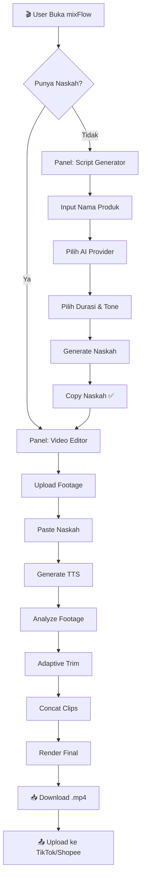
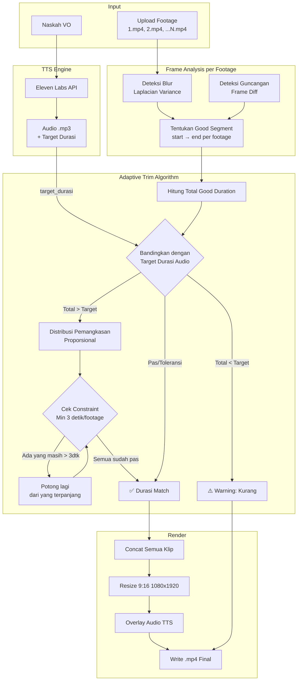
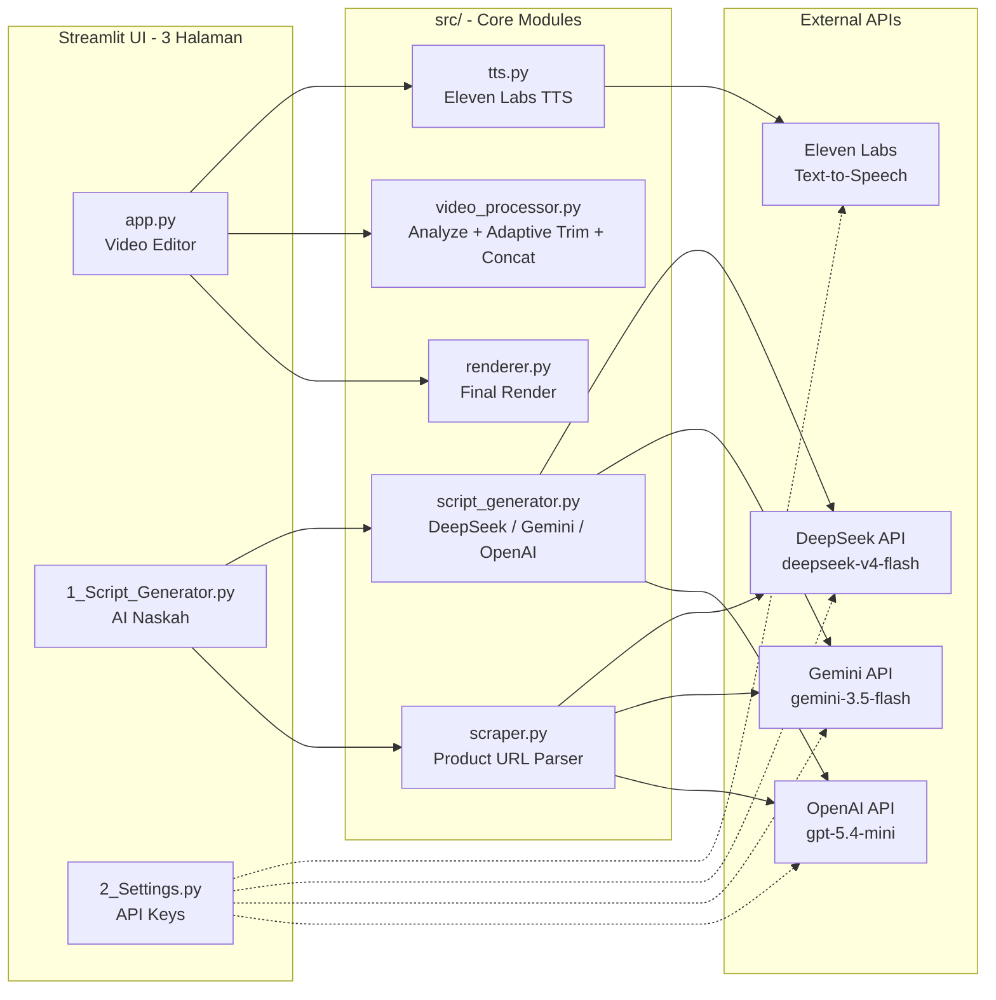
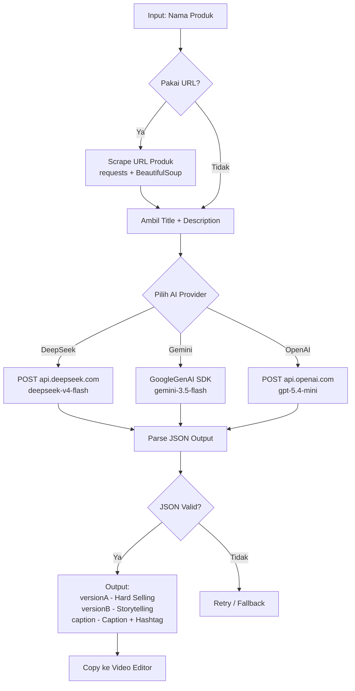

# 🚀 Product Requirements Document (PRD)

**Nama Proyek:** mixFlow  
**Jenis:** Web Application (Streamlit)  
**Deskripsi:** Aplikasi all-in-one untuk content creator affiliate — menggabungkan AI Script Generator untuk membuat naskah video pendek (TikTok/Shopee) dengan Video Editor yang dilengkapi Text-to-Speech (Eleven Labs) dan adaptive trim otomatis.

---

## 1. Target Pengguna

Content creator affiliate di platform:
- TikTok Shop
- Shopee Video
- Shopee Live (short video)

## 2. Fitur Inti

### A. AI Script Generator (Panel 1)
Membuat naskah voice-over video pendek untuk promosi produk affiliate secara otomatis menggunakan AI.

| Fitur | Deskripsi |
|---|---|
| **Input Nama Produk** | User memasukkan nama produk yang akan dipromosikan |
| **Input URL Produk** _(opsional)_ | Scraping halaman produk untuk mendapatkan konteks (judul, deskripsi) |
| **Pilih AI Provider** | DeepSeek (`deepseek-v4-flash`), Google Gemini (`gemini-3.5-flash`), OpenAI (`gpt-5.4-mini`) |
| **Pilih Durasi Video** | 15 detik, 30 detik, 60 detik, 90 detik (mempengaruhi panjang naskah) |
| **Pilih Gaya Bahasa** | Casual & Menarik, Formal, Humor, dll |
| **Pilih Target Audiens** | Umum, Ibu Rumah Tangga, Gen Z, Milenial, dll |
| **Output** | JSON: `versionA` (Hard-Selling), `versionB` (Storytelling), `caption` |

**Aturan Konten Naskah** (hard-coded di system prompt):
- DILARANG menyebut nama marketplace (Shopee, Tokopedia, Lazada, TikTok Shop, dll)
- DILARANG menyebut nama media sosial (Instagram, IG, Facebook, FB, YouTube, YT, TikTok, X, Twitter, dll)
- DILARANG menggunakan "Klik link di bio!" atau "keranjang kuning"
- Gunakan CTA afiliator: "cek keranjang di bawah video ini" atau "klik tautan di bawah"
- Format paragraf pendek (2-3 kalimat per paragraf), dipecah sebagai array

### B. Video Editor (Panel Utama)
Menggabungkan footage video + voice-over TTS menjadi satu video short vertical siap upload.

| Fitur | Deskripsi |
|---|---|
| **Upload Footage** | Multi-file upload (.mp4, .mov, .avi), bisa drag & drop |
| **Auto-Analyze** | Deteksi blur (Laplacian variance) & guncangan (frame diff) per footage |
| **Adaptive Trim** | Potong otomatis bagian awal/akhir yang jelek, durasi menyesuaikan audio TTS |
| **TTS Generation** | Text-to-Speech via Eleven Labs API |
| **Concat + Render** | Gabung footage + overlay audio → output 9:16 (1080×1920) H.264 |

**Constraint Adaptive Trim:**
- Setiap footage minimal tersisa **3 detik** bagian bagus
- Pemangkasan proporsional: footage panjang kena pangkas lebih besar
- Total durasi video akhir ≈ durasi audio TTS

### C. Settings (Panel 3)
Konfigurasi API keys untuk semua layanan eksternal:

| Key | Layanan |
|---|---|
| `ELEVENLABS_API_KEY` | Text-to-Speech |
| `DEEPSEEK_API_KEY` | AI Script Generator (DeepSeek) |
| `GEMINI_API_KEY` | AI Script Generator (Google Gemini) |
| `OPENAI_API_KEY` | AI Script Generator (OpenAI) |
| `ELEVENLABS_VOICE_ID` | Voice default untuk TTS |
| `MIN_KEEP_DURATION` | Minimal durasi per footage (default: 3 detik) |

---

## 3. Diagram & Alur Kerja

### 3.1 Flow Utama Aplikasi



### 3.2 Detail Flow Adaptive Trim (Inti Video Editor)



### 3.3 Arsitektur Aplikasi



### 3.4 Alur Script Generator



---

## 4. Tech Stack

| Kategori | Teknologi |
|---|---|
| **UI Framework** | Streamlit (Python) |
| **Video Processing** | moviepy + OpenCV |
| **Text-to-Speech** | Eleven Labs Python SDK |
| **AI Script Gen** | HTTP REST calls (DeepSeek, Google GenAI SDK, OpenAI SDK) |
| **Web Scraping** | requests + BeautifulSoup4 |
| **Image Processing** | Pillow |
| **Config/Env** | python-dotenv + Streamlit session_state |

---

## 5. Struktur Proyek

```
mixFlow/
├── app.py                        # Main: Video Editor
├── pages/
│   ├── 1_📝_Script_Generator.py  # AI Script Generator
│   └── 2_⚙️_Settings.py          # API Keys Configuration
├── requirements.txt
├── .env.example
├── src/
│   ├── __init__.py
│   ├── tts.py                    # Eleven Labs TTS
│   ├── video_processor.py        # Adaptive trim + concat
│   ├── renderer.py               # Final render
│   ├── script_generator.py       # AI script generation
│   └── scraper.py                # Product URL scraping
├── uploads/                      # Temp footage
├── outputs/                      # Rendered videos
├── PRD.md                        # This file
├── PROGRESS.md                   # Development progress
└── README.md                     # User documentation
```

---

## 6. Referensi

- **VO-Script-Generator**: [https://github.com/Muhira007/VO-Script-Generator](https://github.com/Muhira007/VO-Script-Generator) — referensi untuk sistem prompt AI, aturan konten, dan struktur output naskah
- **Eleven Labs API**: [https://elevenlabs.io/docs/api-reference](https://elevenlabs.io/docs/api-reference)
- **DeepSeek API**: [https://api.deepseek.com/v1/chat/completions](https://api.deepseek.com/v1/chat/completions)

---

## 7. 🔒 Keamanan & Proteksi Data Sensitif

### Aturan Mutlak
Semua credential, API key, dan data sensitif **DILARANG KERAS** masuk ke repo GitHub.

| File | Status Repo | Keterangan |
|---|---|---|
| `.env` | ❌ **DILARANG COMMIT** | Berisi API key asli (terdaftar di `.gitignore`) |
| `.env.example` | ✅ Aman di-commit | Template dengan nilai placeholder |
| `uploads/` | ❌ **DILARANG COMMIT** | Folder footage user (terdaftar di `.gitignore`) |
| `outputs/` | ❌ **DILARANG COMMIT** | Hasil render video (terdaftar di `.gitignore`) |
| `.streamlit/secrets.toml` | ❌ **DILARANG COMMIT** | Secrets Streamlit (terdaftar di `.gitignore`) |
| Kode sumber (`src/`, `app.py`, dll) | ✅ Aman di-commit | Tidak mengandung hardcoded key |

### Proteksi yang Sudah Dipasang
- `.gitignore` — memblokir `.env`, `uploads/`, `outputs/`, `__pycache__/`, `.streamlit/secrets.toml`
- `.env.example` — template dengan placeholder `your_xxx_key_here`
- Semua API key hanya lewat input UI Streamlit (`st.text_input(type="password")`) atau environment variable

### Checklist Sebelum Commit
- [ ] Tidak ada API key hardcoded di source code
- [ ] `.env` tidak masuk staging area
- [ ] File user di `uploads/` dan `outputs/` tidak masuk staging area

---

## 8. Non-Goals (Sengaja Ditiadakan)

Fitur-fitur dari VO-Script-Generator yang TIDAK diimplementasi:
- ❌ Sistem autentikasi (login/register)
- ❌ Sistem kredit/langganan
- ❌ Payment gateway (Midtrans)
- ❌ Dashboard admin
- ❌ Riwayat generasi (database)
- ❌ Mode B-Roll / Roleplay / Hook-Only (bisa ditambah nanti)

---

_Dokumen ini dibuat pada 27 Juni 2026._
