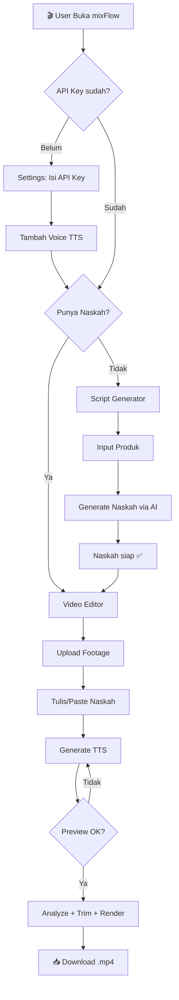
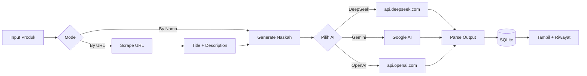
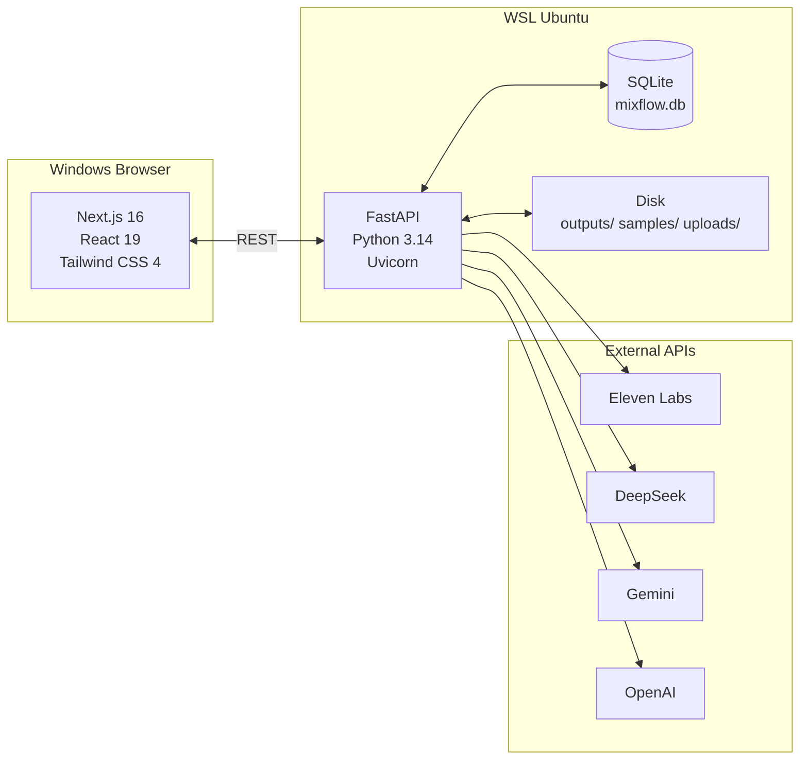
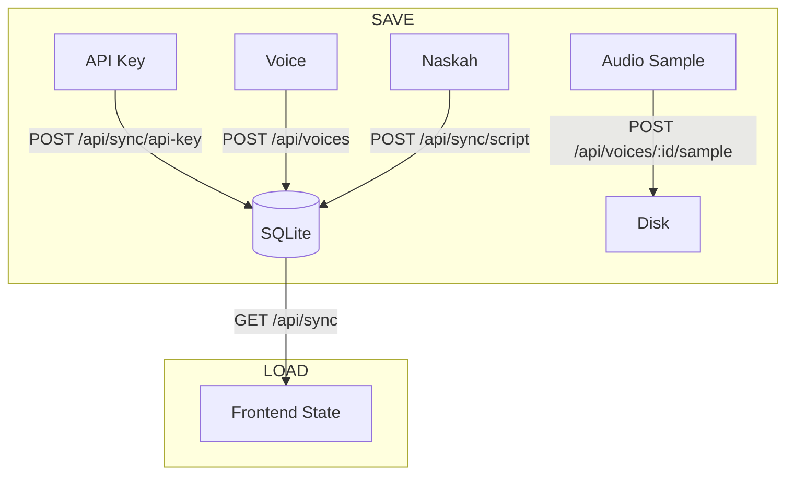

# 🚀 Product Requirements Document (PRD)

**Nama Proyek:** mixFlow  
**Jenis:** Web Application — Next.js (Frontend) + FastAPI (Backend)  
**Deskripsi:** Aplikasi all-in-one untuk content creator affiliate — menggabungkan AI Script Generator untuk membuat naskah video pendek dengan Video Editor yang dilengkapi Text-to-Speech (Eleven Labs) dan adaptive trim otomatis.

---

## 1. Target Pengguna

Content creator affiliate di platform video pendek:
- TikTok Shop / Shopee Video
- Konten promosi produk (review, unboxing, hard-selling)

## 2. Fitur Inti

### A. AI Script Generator
Membuat naskah voice-over video pendek untuk promosi produk affiliate secara otomatis menggunakan AI.

| Fitur | Deskripsi |
|---|---|
| **Input Produk** | By Nama Produk (teks) atau By URL (auto-scrape judul + deskripsi) |
| **AI Provider** | DeepSeek (`deepseek-v4-flash`), Google Gemini (`gemini-3.5-flash`), OpenAI (`gpt-5.4-mini`) |
| **Durasi Video** | 15, 30, 60, 90 detik — target kata: 55, 110, 220, 330 |
| **Gaya Bahasa** | 16 opsi: Santai & Gaul, Hard Selling, Storytelling, Edukasi, Savage, ASMR, Elegan, Misteri, Curhat, Brutal Review, Challenge, Tips & Hacks, Breaking News, Pantun, Motivasi, Ngerap |
| **Target Audiens** | Umum, Ibu Rumah Tangga, Gen Z, Milenial, Pekerja Kantoran |
| **Output** | Single naskah natural + caption + hashtag |
| **Riwayat** | Semua naskah tersimpan di SQLite, bisa dipakai ulang di Video Editor |

**Aturan Konten** (hard-coded di system prompt):
- DILARANG menyebut nama marketplace
- DILARANG menyebut nama media sosial
- DILARANG menggunakan "klik link di bio" atau "keranjang kuning"
- CTA: "cek keranjang di bawah video ini" atau "klik tautan di bawah"

### B. Video Editor
Menggabungkan footage video + voice-over TTS menjadi satu video short vertical.

| Fitur | Deskripsi |
|---|---|
| **Upload Footage** | Multi-file, drag & drop, thumbnail preview, sort (upload/name/size/date), number labels |
| **Sumber Naskah** | Dari Teks (tulis/paste → TTS) atau Dari Audio (upload + library hasil TTS) |
| **TTS Generation** | ElevenLabs API — generate dari teks, preview audio di pipeline |
| **Audio Library** | List 5 file audio terbaru (hasil TTS + upload), preview play, pilih untuk render |
| **Progress Pipeline** | 6-step: Upload → TTS → Analyze → Trim → Concat → Render |
| **Output Resolusi** | 1080×1920 (Full HD) atau 720×1280 (HD) — H.264 |

### C. Settings & Voice Manager
| Fitur | Deskripsi |
|---|---|
| **API Keys** | ElevenLabs, DeepSeek, Gemini, OpenAI — semua tersimpan di SQLite |
| **Voice Manager** | Multi-voice: nama, Voice ID, bahasa (13 opsi), gender, label (8 opsi) |
| **Audio Sample** | Upload sample suara per voice → play preview → persistent di disk |
| **Video Settings** | Min keep duration, output format, video codec |
| **Content Rules** | Aturan konten yang di-inject ke system prompt AI |
| **Danger Zone** | Hapus footage, hapus output, hapus semua audio TTS, reset semua |

---

## 3. Diagram & Alur Kerja

### 3.1 Flow Utama Aplikasi



### 3.2 Flow Script Generator



### 3.3 Arsitektur Aplikasi



### 3.4 Flow Penyimpanan Data



---

## 4. Tech Stack

| Layer | Teknologi |
|---|---|
| **Frontend** | Next.js 16, React 19, Tailwind CSS 4, TypeScript |
| **Backend** | FastAPI, Python 3.14, Uvicorn |
| **Database** | SQLite (single file, no server, WAL mode) |
| **AI** | DeepSeek v4 Flash, Google Gemini 3.5 Flash, OpenAI GPT |
| **TTS** | ElevenLabs Multilingual v2 |
| **Video** | FFmpeg, OpenCV, moviepy |
| **Infra** | WSL2 Ubuntu, Windows 10/11 |

---

## 5. Database Schema

```sql
api_keys       (provider TEXT PK, value TEXT)
settings       (key TEXT PK, value TEXT)
voices         (id INTEGER PK, name TEXT, voice_id TEXT UNIQUE,
                language TEXT, gender TEXT, label TEXT, created_at TEXT)
script_history (id TEXT PK, script TEXT, caption TEXT,
                product_name TEXT, style TEXT, duration TEXT,
                audience TEXT, created_at TEXT)
output_history (id INTEGER PK, name TEXT, duration TEXT,
                size TEXT, created_at TEXT)
```

**Live DB Browser:** `http://localhost:8000/api/db`

---

## 6. Struktur Proyek

```
mixflow/
├── frontend/          # Next.js 16 App Router
│   ├── src/app/       # 4 halaman (editor, script-gen, settings, outputs)
│   ├── src/components/ # 22+ React components
│   ├── src/contexts/  # AppContext (useReducer + SQLite sync)
│   └── src/lib/       # API client, constants, utils
├── backend/           # FastAPI
│   ├── app/routers/   # 7 route modules
│   ├── app/services/  # Business logic
│   ├── app/database.py # SQLite CRUD
│   └── data/          # mixflow.db + samples/
├── outputs/           # Generated audio + video
├── uploads/           # User footage
├── start-all.sh       # Start semua service
├── stop-all.sh        # Stop semua service
├── start.bat / stop.bat
├── README.md
├── PRD.md
└── PROGRESS.md
```

---

## 7. Keamanan

- `.env` tidak di-commit (`.gitignore`)
- API key disimpan di SQLite (tidak exposed ke frontend via SSR)
- Input password pakai `<input type="password">`
- File upload tidak executable (hanya `.mp4`, `.mov`, `.mp3`, `.wav`)
- CORS whitelist: `http://localhost:3000`

---

## 8. Lingkungan Development

**Mesin:** Dell Latitude — Windows 10 Pro + WSL2 Ubuntu 26.04  
**CPU:** Intel Core i5-8365U (4C/8T, 1.6 GHz base / 4.1 GHz boost)  
**RAM:** 16 GB DDR4-2666  
**GPU:** Intel UHD Graphics 620 (CPU-only encoding)  
**Storage:** ADATA Legend 710 NVMe SSD 512 GB

**Estimasi performa:**

| Proses | Waktu |
|---|---|
| Generate TTS (30s) | ~5-10 detik |
| Analyze footage (4×15s) | ~10-20 detik |
| Render final (60s, 1080p) | 3-7 menit |
| Render final (60s, 720p) | 1.5-3 menit |

---

_Dokumen ini dibuat pada 27 Juni 2026. Terakhir diupdate dengan status development terkini._
