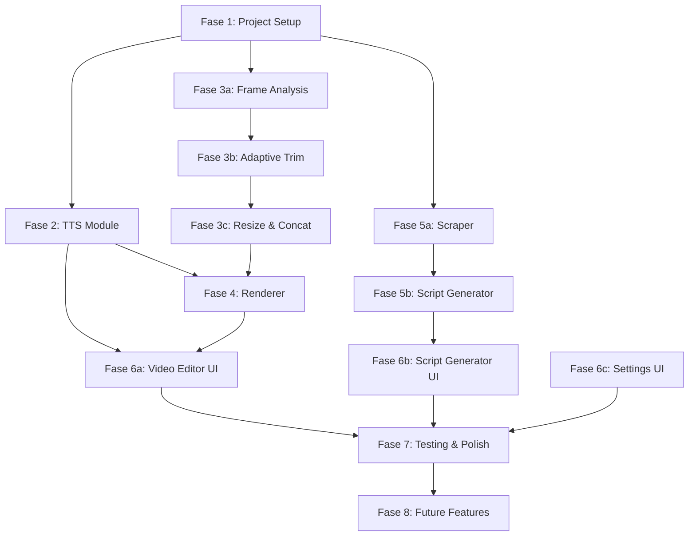
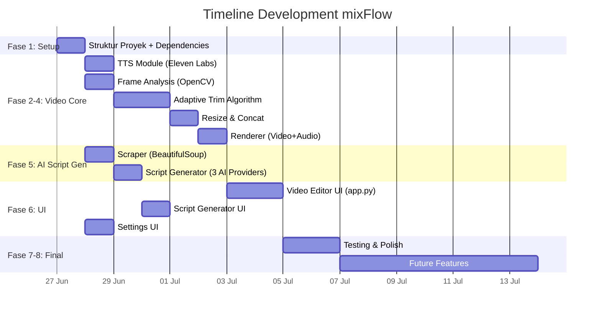

# 📊 Development Progress — mixFlow

**Proyek dimulai:** 27 Juni 2026  
**Status:** 🔴 Not Started

---

## 📊 Diagram Ketergantungan Fase

## 🗺️ Development Roadmap

---

## Fase 1: Project Setup & Struktur Dasar
**Status:** ⬜ Not Started

- [ ] Inisialisasi struktur folder proyek
- [ ] Buat `requirements.txt` dan install dependencies
- [ ] Buat `.env.example`
- [ ] Buat `app.py` (entry point Streamlit)
- [ ] Buat folder `pages/`
- [ ] Buat folder `uploads/` dan `outputs/`
- [ ] Buat `src/__init__.py`

---

## Fase 2: Modul TTS (Eleven Labs)
**Status:** ⬜ Not Started  
**File:** `src/tts.py`

- [ ] Implementasi `text_to_speech(text, api_key, voice_id) → (Path, float)`
- [ ] Handle chunking untuk teks panjang (>5000 karakter)
- [ ] Return durasi audio (detik)
- [ ] Error handling: invalid API key, quota habis, timeout

---

## Fase 3: Modul Video Processor (Analyze + Adaptive Trim + Concat)
**Status:** ⬜ Not Started  
**File:** `src/video_processor.py`

### 3a. Frame Analysis
- [ ] Implementasi deteksi blur (Laplacian variance via OpenCV)
- [ ] Implementasi deteksi guncangan (frame-to-frame difference)
- [ ] Fungsi `analyze_footage(filepath) → dict`
- [ ] Return: `{good_start_frame, good_end_frame, total_frames, fps}`

### 3b. Adaptive Trim Algorithm
- [ ] Fungsi `adaptive_trim(analyses, target_duration, min_keep=3.0) → list[ClipSegment]`
- [ ] Hitung total good duration semua footage
- [ ] Distribusi pemangkasan proporsional
- [ ] Constraint: minimal 3 detik per footage
- [ ] Cascade/iteratif sampai durasi ≈ target
- [ ] Fallback: trim persentase (10% awal, 10% akhir)

### 3c. Resize & Concat
- [ ] Fungsi `concat_clips(segments) → VideoFileClip`
- [ ] Resize/crop ke 9:16 (1080×1920)
- [ ] Concat semua klip jadi satu

---

## Fase 4: Modul Renderer (Video + Audio → Final Output)
**Status:** ⬜ Not Started  
**File:** `src/renderer.py`

- [ ] Fungsi `render(video_clip, audio_path) → Path`
- [ ] Overlay audio ke video
- [ ] Write output H.264 + AAC, 1080×1920
- [ ] Handle durasi mismatch (audio > video atau sebaliknya)

---

## Fase 5: Modul AI Script Generator
**Status:** ⬜ Not Started  
**File:** `src/script_generator.py`, `src/scraper.py`

### 5a. Scraper
- [ ] Fungsi `scrape_product_url(url) → dict`
- [ ] Fetch HTML + User-Agent spoofing
- [ ] Parse title, meta description, body text

### 5b. Script Generator
- [ ] Fungsi `generate_script(name, provider, api_key, duration, style, audience) → dict`
- [ ] Support DeepSeek API (`deepseek-v4-flash`)
- [ ] Support Google Gemini API (`gemini-3.5-flash`)
- [ ] Support OpenAI API (`gpt-5.4-mini`)
- [ ] System prompt adaptasi dari VO-Script-Generator
- [ ] Parse JSON output (versionA, versionB, caption)
- [ ] Error handling per provider + retry logic

---

## Fase 6: UI Streamlit (3 Halaman)
**Status:** ⬜ Not Started

### 6a. Main Page — Video Editor (`app.py`)
- [ ] Sidebar: navigasi + API keys quick-access
- [ ] File uploader (multi-file, drag & drop)
- [ ] Text area untuk naskah VO
- [ ] Voice selector (Eleven Labs)
- [ ] Progress bar: [Analyze] → [TTS] → [Adaptive Trim] → [Concat] → [Render]
- [ ] Download button
- [ ] Preview video (opsional)

### 6b. Script Generator (`pages/1_📝_Script_Generator.py`)
- [ ] Input: nama produk
- [ ] Select: AI provider (DeepSeek / Gemini / OpenAI)
- [ ] Select: durasi video (15s / 30s / 60s / 90s)
- [ ] Select: gaya bahasa
- [ ] Select: target audiens
- [ ] Output: text area (bisa copy-paste ke Video Editor)
- [ ] Tombol "Copy to Editor"

### 6c. Settings (`pages/2_⚙️_Settings.py`)
- [ ] Input: Eleven Labs API Key
- [ ] Input: DeepSeek API Key
- [ ] Input: Gemini API Key
- [ ] Input: OpenAI API Key
- [ ] Select: Default TTS Voice ID
- [ ] Number input: Min keep duration (default 3 detik)
- [ ] Simpan di `st.session_state`

---

## Fase 7: Testing & Polish
**Status:** ⬜ Not Started

- [ ] Test Script Generator dengan semua provider
- [ ] Test TTS dengan berbagai panjang naskah
- [ ] Test Adaptive Trim dengan footage berbagai durasi
- [ ] Test edge cases (0 footage, naskah kosong, API key invalid)
- [ ] Test output: format 9:16, audio sync
- [ ] Buat README.md dokumentasi pengguna
- [ ] Buat `.env.example`

---

## Fase 8: Fitur Tambahan (Future)
**Status:** ⬜ Future

- [ ] Subtitle otomatis (overlay teks dari naskah)
- [ ] Background music (volume rendah)
- [ ] Mode B-Roll / Roleplay / Hook-Only
- [ ] Preview real-time sebelum render
- [ ] Batch processing (banyak video sekaligus)
- [ ] Template naskah preset

---

_Legenda:_
- ⬜ Not Started
- 🔄 In Progress
- ✅ Completed
- ❌ Blocked
