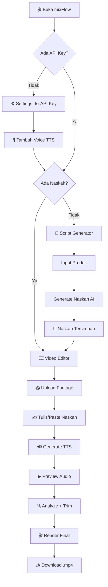
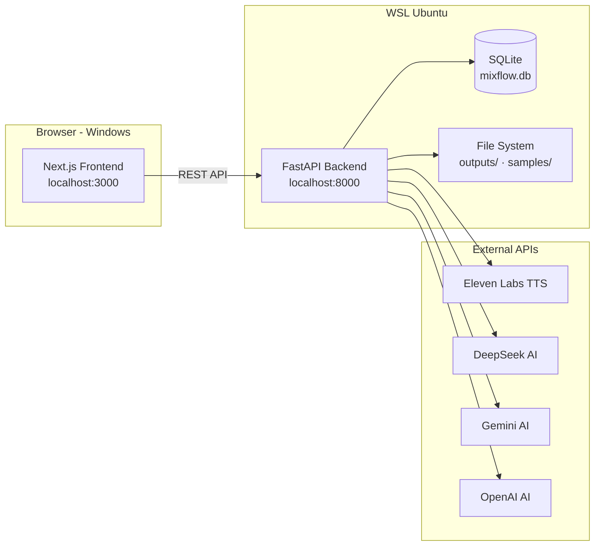
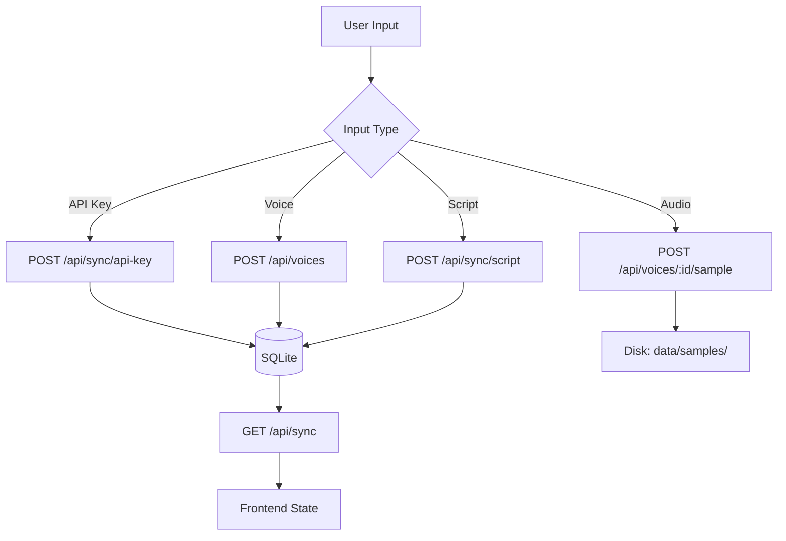
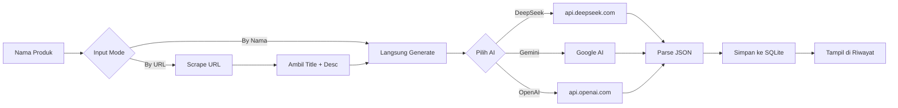

# 🎬 mixFlow — AI Video Editor for Content Creator Affiliate

**mixFlow** adalah aplikasi all-in-one untuk content creator affiliate: menggabungkan **AI Script Generator** (naskah voice-over otomatis) dengan **Video Editor** (TTS + trim + render) dalam satu workflow.

    

---

## 📖 Daftar Isi

- [Fitur](#-fitur)
- [Tech Stack](#-tech-stack)
- [Struktur Proyek](#-struktur-proyek)
- [Installation](#-installation)
  - [Prasyarat](#prasyarat)
  - [Clone & Setup Backend](#1-clone--setup-backend)
  - [Setup Frontend](#2-setup-frontend)
  - [Start Aplikasi](#3-start-aplikasi)
- [Cara Menggunakan](#-cara-menggunakan)
  - [1. Settings — Isi API Key](#1-settings--isi-api-key)
  - [2. TTS Voice — Tambah Suara](#2-tts-voice--tambah-suara)
  - [3. Script Generator — Generate Naskah](#3-script-generator--generate-naskah)
  - [4. Video Editor — Render Video](#4-video-editor--render-video)
- [Arsitektur & Diagram](#-arsitektur--diagram)
- [Database](#-database)
- [FAQ](#-faq)

---

## 🎯 Fitur

| Modul | Fitur |
|---|---|
| **🤖 Script Generator** | Generate naskah voice-over pakai AI (DeepSeek, Gemini, OpenAI). 16 gaya bahasa + multi-durasi. |
| **🔊 TTS Engine** | Text-to-Speech via ElevenLabs. Multi-voice management. Audio library + preview. |
| **🎞️ Video Editor** | Upload footage, auto-analyze, adaptive trim, concat, render ke 9:16 vertical. |
| **🎙️ Voice Manager** | Kelola banyak suara TTS (nama, Voice ID, bahasa, gender, label). Upload sample audio. |
| **💾 SQLite Storage** | Semua data (API keys, voices, settings, riwayat) tersimpan persistent di database lokal. |
| **📜 Riwayat Naskah** | Setiap naskah yang digenerate otomatis tersimpan. Bisa dipakai ulang kapan saja. |
| **⚙️ Settings** | Kelola API keys, voices, aturan konten, danger zone (reset/hapus). |

---

## 💻 Tech Stack

```
┌─────────────────────────────────────────┐
│              BROWSER (Windows)           │
│         Next.js 16 · React 19           │
│         Tailwind CSS 4 · TypeScript     │
└──────────────┬──────────────────────────┘
               │ REST API (fetch)
┌──────────────▼──────────────────────────┐
│            WSL Ubuntu 26.04              │
│         FastAPI · Python 3.14           │
│         Uvicorn · httpx · Pydantic      │
│                                          │
│  ┌──────────────────────────────────┐   │
│  │         SQLite Database           │   │
│  │   backend/data/mixflow.db        │   │
│  └──────────────────────────────────┘   │
│  ┌──────────────────────────────────┐   │
│  │      File Storage (Disk)          │   │
│  │   uploads/ · outputs/ · samples/ │   │
│  └──────────────────────────────────┘   │
└──────────────┬──────────────────────────┘
               │
    ┌──────────┼──────────┬────────────┐
    ▼          ▼          ▼            ▼
┌──────┐ ┌──────┐ ┌────────┐ ┌──────────┐
│Eleven│ │Deep  │ │Google  │ │ OpenAI   │
│ Labs │ │Seek  │ │Gemini  │ │          │
└──────┘ └──────┘ └────────┘ └──────────┘
```

---

## 📂 Struktur Proyek

```
mixflow/
├── backend/
│   ├── app/
│   │   ├── main.py              # FastAPI entry point
│   │   ├── config.py            # Environment config
│   │   ├── database.py          # SQLite CRUD operations
│   │   ├── routers/
│   │   │   ├── tts.py           # TTS generate + audio upload + library
│   │   │   ├── script.py        # AI script generator
│   │   │   ├── scraper.py       # Product URL scraper
│   │   │   ├── video.py         # Video analysis + render
│   │   │   ├── voices.py        # Voice CRUD + audio samples
│   │   │   ├── sync.py          # Global state sync endpoint
│   │   │   └── db_browser.py    # Live DB viewer (HTML)
│   │   └── services/
│   │       ├── tts_service.py   # ElevenLabs TTS logic
│   │       ├── script_service.py # AI prompt + API calls
│   │       ├── scraper_service.py
│   │       └── video_service.py
│   ├── data/
│   │   ├── mixflow.db           # SQLite database
│   │   └── samples/             # Voice audio samples
│   ├── outputs/                 # Generated TTS audio + rendered videos
│   ├── uploads/                 # User-uploaded footage
│   ├── requirements.txt
│   └── .venv/
│
├── frontend/
│   ├── src/
│   │   ├── app/                 # Next.js App Router pages
│   │   ├── components/          # React components
│   │   ├── contexts/            # Global state (AppContext)
│   │   └── lib/                 # API client, constants, utils
│   └── package.json
│
├── start-all.sh                 # Start semua service
├── stop-all.sh                  # Stop semua service
├── start.bat / stop.bat         # Windows launcher
├── README.md                    # ← this file
├── PRD.md                       # Product Requirements
└── PROGRESS.md                  # Development progress
```

---

## 🚀 Installation

### Prasyarat

- **Windows 10/11** dengan **WSL2 Ubuntu** terinstall
- **Python 3.11+** (di dalam WSL)
- **Node.js 22+** + **npm** (di dalam WSL)
- **FFmpeg** + **FFprobe** (untuk video processing)

```bash
# Di WSL Ubuntu:
sudo apt update
sudo apt install ffmpeg python3-venv python3-pip -y

# Install Node.js via nvm
curl -o- https://raw.githubusercontent.com/nvm-sh/nvm/v0.40.1/install.sh | bash
nvm install 22
```

### 1. Clone & Setup Backend

```bash
# Clone repo
cd ~
git clone https://github.com/Muhira007/mixflow.git
cd mixflow

# Setup Python virtual environment
cd backend
python3 -m venv .venv
source .venv/bin/activate
pip install -r requirements.txt

# Copy .env template & isi API key
cp ../.env.example ../.env
nano ../.env   # isi minimal DEEPSEEK_API_KEY + ELEVENLABS_API_KEY
```

### 2. Setup Frontend

```bash
cd ~/mixflow/frontend
npm install
```

### 3. Start Aplikasi

**Dari Windows (double-click):**
- `start.bat` — Start backend + frontend
- `stop.bat` — Stop semua

**Dari WSL terminal:**
```bash
cd ~/mixflow
bash start-all.sh   # Start
bash stop-all.sh    # Stop
```

> **Akses:** Frontend `http://localhost:3000` · API Docs `http://localhost:8000/docs` · DB Browser `http://localhost:8000/api/db`

---

## 📘 Cara Menggunakan

### Flowchart Utama



### 1. Settings — Isi API Key

Buka `http://localhost:3000/settings`:

```
⚙️ Settings & API Keys

🔊 ElevenLabs API Key:    [el_xxxxxxxxxxxxx          ]
🧠 DeepSeek API Key:       [sk-xxxxxxxxxxxxx          ]
🔮 Gemini API Key:         [AIza...                   ]
🧬 OpenAI API Key:         [sk-proj-...               ]

[💾 Simpan Konfigurasi]
```

> **Minimal:** Isi **DeepSeek** (untuk Script Generator) + **ElevenLabs** (untuk TTS).

### 2. TTS Voice — Tambah Suara

Di halaman yang sama, scroll ke **Daftar Suara TTS**:

```
🎙️ Daftar Suara TTS

➕ Tambah Voice Baru
┌──────────────────┬─────────────────────────┐
│ Nama: Rina       │ Voice ID: 21m00Tcm4T... │
├──────────────────┼─────────────────────────┤
│ Bahasa: Indonesia│ Gender: Female           │
└──────────────────┴─────────────────────────┘
Label: [Narasi] [Sosial Media] [Iklan] [Edukasi] ...

[➕ Tambah Voice]
```

Setelah voice ditambah:
- Klik **📂 Upload Sample Audio** — upload file .mp3 suara sample
- Klik **▶ Play** — dengar preview
- Sampel otomatis tersimpan ke `backend/data/samples/`

### 3. Script Generator — Generate Naskah

Buka `http://localhost:3000/script-generator`:

```
🤖 AI Script Generator

┌─ Input Produk ────────┐  ┌─ Konfigurasi Naskah ────┐
│ [📛 Nama] [🔗 URL]    │  │ AI:    [DeepSeek ▾]     │
│ Nama: Gamis Syari     │  │ Durasi: [60 detik ▾]    │
└───────────────────────┘  │ Gaya:   [Santai ▾]      │
                           │ Target: [Umum ▾]        │
                           │ [✨ Generate Naskah]     │
                           └──────────────────────────┘

┌─ Output Naskah ────────────────────────────────────┐
│ 🎙️ Naskah Voice-Over              [📋 Copy]        │
│ Hai guys! Lagi cari gamis syari yang...             │
│                                                     │
│ 📝 Caption + Hashtags             [📋 Copy]         │
│ #GamisSyari #OOTD #FashionMuslim                    │
│                                                     │
│ [➡️ Pakai Naskah di Video Editor]                   │
└─────────────────────────────────────────────────────┘

┌─ 📜 Riwayat Naskah (3) ────────────────────────────┐
│ 1. Gamis Syari Premium  [Santai] 60dtk  [▶][Pakai] │
│ 2. Serum Wajah Glow     [Edukasi] 30dtk [▶][Pakai] │
│ 3. Tas Branded Limited  [FOMO] 60dtk     [▶][Pakai] │
└─────────────────────────────────────────────────────┘
```

### 4. Video Editor — Render Video

Buka `http://localhost:3000/`:

```
🎞️ Video Editor

┌─ 📤 Upload Footage ────────────────────────────────┐
│ Urutkan: [By Upload ▾]                              │
│ ┌─────────────────────────────────────────────────┐ │
│ │ [1] [🎬] intro.mp4   45MB  27 Jun      [✕]     │ │
│ │ [2] [🎬] review.mp4  128MB 27 Jun      [✕]     │ │
│ │ [3] [🎬] closing.mp4 22MB  27 Jun      [✕]     │ │
│ └─────────────────────────────────────────────────┘ │
└─────────────────────────────────────────────────────┘

┌─ 🎙️ Naskah Voice-Over & TTS ───────────────────────┐
│ Sumber: [✍️ Tulis Naskah] [🎵 Dari Audio]           │
│                                                     │
│ Naskah: [___________________________________]       │
│ Suara:  [Rina · ♀ · Narasi ▾] [▶]                  │
│ [🔊 Generate TTS]                                   │
└─────────────────────────────────────────────────────┘

┌─ 🔄 Progress Pipeline ─────────────────────────────┐
│  ✓        ✓        ▶        🔍       ✂️       🔗   │
│ Upload   TTS    Preview  Analyze   Trim   Concat   │
│                  (klik!)                            │
└─────────────────────────────────────────────────────┘
```

---

## 🏗️ Arsitektur & Diagram

### Alur Data



### Flow Simpan Data



### Flow Script Generator



---

## 🗄️ Database

### Tables

| Table | Fields | Keterangan |
|---|---|---|
| `api_keys` | provider, value | API keys (elevenlabs, deepseek, gemini, openai) |
| `settings` | key, value | App settings (outputFormat, videoCodec, dll) |
| `voices` | id, name, voice_id, language, gender, label | TTS voice list |
| `script_history` | id, script, caption, product_name, style, duration, audience | Riwayat naskah |
| `output_history` | id, name, duration, size | Riwayat video output |

### Live DB Browser

Buka `http://localhost:8000/api/db` — tampilan HTML tabel semua data live. Klik **Refresh** untuk update real-time.

### File Storage

| Direktori | Isi |
|---|---|
| `backend/data/mixflow.db` | SQLite database |
| `backend/data/samples/` | Audio sample suara (`.mp3`) |
| `backend/outputs/` | Hasil generate TTS + render video (`.mp3`, `.mp4`) |
| `backend/uploads/` | Footage yang diupload user |

---

## ❓ FAQ

**Q: Kenapa pakai SQLite, bukan PostgreSQL/MySQL?**
A: mixFlow adalah **desktop app** (jalan di laptop pribadi). SQLite tanpa server, tanpa setup, database 1 file langsung pakai. Cocok untuk single-user.

**Q: Kenapa pakai WSL, bukan native Windows?**
A: Backend Python (OpenCV, moviepy, FFmpeg) jauh lebih stabil di Linux. WSL memberikan environment Linux tanpa dual-boot.

**Q: Kenapa data kadang hilang saat refresh?**
A: Buka `http://localhost:8000/api/db` — cek apakah data tersimpan di SQLite. Kalau tidak ada, berarti save gagal (cek Console F12 untuk error).

**Q: Upload audio sample hilang setelah restart?**
A: File disimpan di `backend/data/samples/`. Kalau file ada di folder itu, seharusnya muncul. Buka `/api/db` dan cek `has_sample` = True.

**Q: Naskah AI hasilnya kosong?**
A: Pastikan API key provider (DeepSeek/Gemini) valid dan punya kuota. Cek error di toast atau Network tab.

---

## 📝 Referensi

- **VO-Script-Generator:** [github.com/Muhira007/VO-Script-Generator](https://github.com/Muhira007/VO-Script-Generator)
- **ElevenLabs API:** [elevenlabs.io/docs](https://elevenlabs.io/docs/api-reference)
- **DeepSeek API:** [api.deepseek.com](https://api.deepseek.com/v1/chat/completions)

---

## 📄 Lisensi

MIT License — bebas dipakai, dimodifikasi, dan didistribusikan.

---

<p align="center">
  <b>Dibuat dengan ❤️ oleh</b><br/>
  <b>Dede Muhira</b><br/>
  <sub>kang demuh / <a href="https://github.com/Muhira007">Muhira007</a></sub>
</p>
