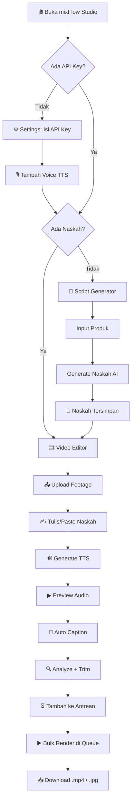
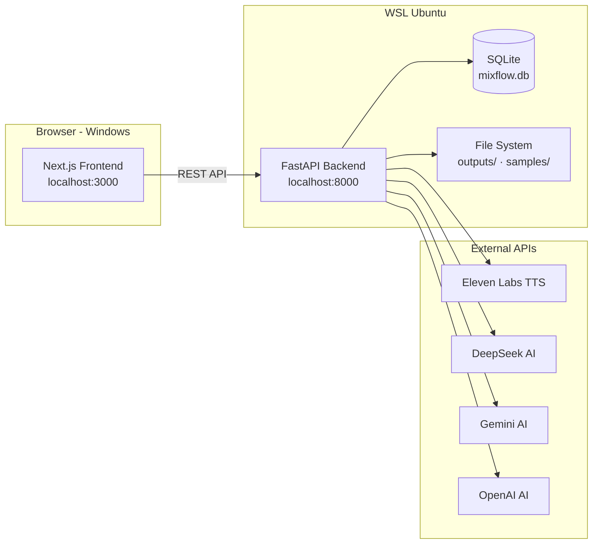
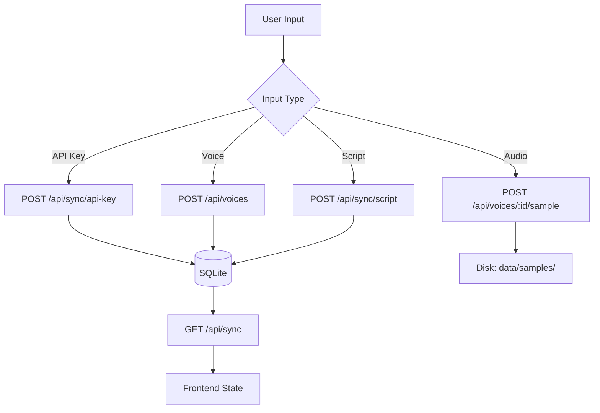
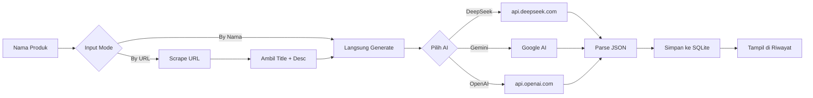

# 🎬 mixFlow Studio — AI Video Editor for Content Creator Affiliate

**mixFlow Studio** adalah aplikasi all-in-one untuk content creator affiliate: menggabungkan **AI Script Generator** (naskah voice-over otomatis) dengan **Video Editor** (TTS + trim + render) dalam satu workflow.

     

---

## 📖 Daftar Isi

- [Fitur](#-fitur)
- [Tech Stack](#-tech-stack)
- [Struktur Proyek](#-struktur-proyek)
- [Installation](#-installation)
  - [Prasyarat](#prasyarat)
  - [Clone & Setup Backend](#1-clone--setup-backend)
  - [Setup Frontend](#2-setup-frontend)
  - [Start Aplikasi](#3-start-aplikasi)
- [Cara Menggunakan](#-cara-menggunakan)
  - [1. Settings — Isi API Key](#1-settings--isi-api-key)
  - [2. TTS Voice — Tambah Suara](#2-tts-voice--tambah-suara)
  - [3. Script Generator — Generate Naskah](#3-script-generator--generate-naskah)
  - [4. Video Editor — Render Video](#4-video-editor--render-video)
- [Arsitektur & Diagram](#-arsitektur--diagram)
- [Database](#-database)
- [FAQ](#-faq)

---

## 🎯 Fitur

| Modul | Fitur |
|---|---|
| **🤖 Script Generator** | Generate naskah voice-over pakai AI (DeepSeek, Gemini, OpenAI). 16 gaya bahasa + multi-durasi. |
| **🔊 TTS Engine** | Text-to-Speech via ElevenLabs. Multi-voice management. Audio library + preview. |
| **🎞️ Video Editor** | Upload footage, auto-analyze, adaptive trim, concat, render ke 9:16 vertical. |
| **⏳ Antrean Render** | Sistem antrean (queue) untuk memproses banyak video sekaligus (Bulk Render). |
| **💬 Auto Caption** | Subtitle otomatis menggunakan Whisper STT dengan kustomisasi font/style. |
| **🖼️ Auto Cover** | Pembuatan thumbnail otomatis dengan ekstraksi frame OpenCV dan desain template teks (Pillow). |
| **🎙️ Voice Manager** | Kelola suara TTS. Fitur **Clone Voice** ElevenLabs langsung dari UI. Upload sample audio. |
| **💾 SQLite Storage** | Semua data (API keys, voices, settings, riwayat) tersimpan persisten di database lokal. |
| **📜 Riwayat Naskah** | Naskah yang digenerate tersimpan otomatis dan bisa digunakan ulang kapan saja. |
| **⚙️ Settings** | Kelola API keys, suara, aturan konten. |

---

## 💻 Tech Stack

```
┌─────────────────────────────────────────┐
│              BROWSER (Windows)           │
│         Next.js 16 · React 19           │
│         Tailwind CSS 4 · TypeScript     │
└──────────────┬──────────────────────────┘
               │ REST API (fetch)
┌──────────────▼──────────────────────────┐
│            WSL Ubuntu 26.04              │
│         FastAPI · Python 3.14           │
│         Uvicorn · httpx · Pydantic      │
│                                          │
│  ┌──────────────────────────────────┐   │
│  │         SQLite Database           │   │
│  │   backend/data/mixflow.db        │   │
│  └──────────────────────────────────┘   │
│  ┌──────────────────────────────────┐   │
│  │      File Storage (Disk)          │   │
│  │   uploads/ · outputs/ · samples/ │   │
│  └──────────────────────────────────┘   │
└──────────────┬──────────────────────────┘
               │
    ┌──────────┼──────────┬────────────┐
    ▼          ▼          ▼            ▼
┌──────┐ ┌──────┐ ┌────────┐ ┌──────────┐
│Eleven│ │Deep  │ │Google  │ │ OpenAI   │
│ Labs │ │Seek  │ │Gemini  │ │          │
└──────┘ └──────┘ └────────┘ └──────────┘
```

---

## 📂 Struktur Proyek

```
mixflow/
├── backend/
│   ├── app/
│   │   ├── main.py              # FastAPI entry point
│   │   ├── config.py            # Environment config (Pydantic Settings)
│   │   ├── database.py          # SQLite CRUD operations via SQLModel ORM
│   │   ├── routers/
│   │   │   ├── tts.py           # TTS generate + audio upload + library
│   │   │   ├── script.py        # AI script generator
│   │   │   ├── scraper.py       # Product URL scraper
│   │   │   ├── video.py         # Video analysis + render
│   │   │   ├── voices.py        # Voice CRUD + audio samples + clone
│   │   │   ├── caption.py       # Auto caption (Whisper STT)
│   │   │   ├── cover.py         # Auto cover settings
│   │   │   ├── sync.py          # Global state sync endpoint
│   │   │   └── db_browser.py    # Live DB viewer (HTML)
│   │   └── services/
│   │       ├── tts_service.py   # ElevenLabs TTS logic
│   │       ├── script_service.py # AI prompt + API calls
│   │       ├── scraper_service.py
│   │       ├── video_service.py
│   │       ├── caption_service.py # Whisper STT & SRT generation
│   │       └── cover_gen.py     # OpenCV & Pillow cover generation
│   ├── data/
│   │   ├── mixflow.db           # SQLite database
│   │   └── samples/             # Voice audio samples
│   ├── outputs/                 # Generated TTS audio + rendered videos
│   ├── uploads/                 # User-uploaded footage
│   ├── requirements.txt
│   └── .venv/
│
├── frontend/
│   ├── src/
│   │   ├── app/                 # 5 halaman (editor, script-gen, settings, queue, outputs)
│   │   ├── components/          # React components
│   │   ├── contexts/            # Global state (AppContext)
│   │   └── lib/                 # API client, constants, utils
│   └── package.json
│
├── start-all.sh                 # Start semua service
├── stop-all.sh                  # Stop semua service
├── start.bat / stop.bat         # Windows launcher
├── README.md                    # ← this file
├── PRD.md                       # Product Requirements
└── PROGRESS.md                  # Development progress
```

---

## 🚀 Installation (Zero to Final)

Tutorial ini dirancang dari nol (komputer Windows baru) hingga aplikasi bisa berjalan.

### Tahap 1: Install WSL (Windows Subsystem for Linux)
Jika Anda pengguna Windows 10/11, mixFlow Studio wajib dijalankan di dalam WSL karena library pemrosesan video (seperti `ffmpeg` dan `moviepy`) jauh lebih stabil di lingkungan Linux.

1. Buka **PowerShell** sebagai Administrator (klik kanan Start, pilih Windows PowerShell (Admin)).
2. Ketik perintah berikut dan tekan Enter:
   ```powershell
   wsl --install
   ```
3. Proses ini akan otomatis mengunduh dan menginstal **Ubuntu** sebagai distro default.
4. Jika diminta, **Restart PC/Laptop Anda**.
5. Setelah restart, jendela terminal Ubuntu akan terbuka. Masukkan **Username** dan **Password** baru untuk Ubuntu Anda (password tidak akan terlihat saat diketik, itu normal).

### Tahap 2: Install Dependensi Sistem (di dalam Ubuntu)
Buka terminal Ubuntu (cari "Ubuntu" di Start menu), lalu jalankan perintah berikut secara berurutan:

```bash
# 1. Update sistem paket Ubuntu
sudo apt update && sudo apt upgrade -y

# 2. Install FFmpeg (untuk video) & dependensi Python (untuk library Pillow/AI)
sudo apt install ffmpeg python3-venv python3-pip python3-dev libjpeg-dev zlib1g-dev -y

# 3. Install Node.js (via NVM)
curl -o- https://raw.githubusercontent.com/nvm-sh/nvm/v0.40.1/install.sh | bash
```

> **Penting**: Setelah menginstal NVM, tutup terminal Ubuntu Anda lalu **buka kembali** agar NVM bisa digunakan.

```bash
# 4. Install Node.js versi 22 (LTS)
nvm install 22
```

### Tahap 3: Clone & Setup mixFlow Studio

Masih di dalam terminal Ubuntu, mari kita unduh dan setup aplikasinya.

```bash
# 1. Clone repositori ke dalam folder 'aplikasi' (atau folder pilihan Anda)
mkdir -p ~/aplikasi
cd ~/aplikasi
git clone https://github.com/Muhira007/mixflow.git
cd mixflow

# 2. Setup Backend (Python Virtual Environment)
cd backend
python3 -m venv .venv
source .venv/bin/activate
pip install -r requirements.txt

# 3. Buat file konfigurasi (.env)
cp ../.env.example ../.env
```
*(Catatan: Buka file `.env` dengan editor seperti `nano ../.env` dan masukkan API Key Anda, minimal `DEEPSEEK_API_KEY` dan `ELEVENLABS_API_KEY`)*

```bash
# 4. Setup Frontend (Next.js)
cd ../frontend
npm install
cd ..
```

### Tahap 4: Menjalankan Aplikasi
Anda hanya perlu menjalankan satu script untuk menghidupkan semuanya (Database, Frontend, Backend).

```bash
# Dari dalam folder mixflow di terminal Ubuntu:
./start-all.sh
```

Aplikasi sekarang bisa diakses melalui browser Windows Anda di:
- **Aplikasi Utama**: `http://localhost:3000`
- **API Docs**: `http://localhost:8000/docs`
- **DB Browser**: `http://localhost:8000/api/db`

*(Untuk mematikan aplikasi, jalankan `./stop-all.sh`)*

---

## 📘 Cara Menggunakan

### Flowchart Utama



### 1. Settings — Isi API Key

Buka `http://localhost:3000/settings`:

```
⚙️ Settings & API Keys

🔊 ElevenLabs API Key:    [el_xxxxxxxxxxxxx          ]
🧠 DeepSeek API Key:       [sk-xxxxxxxxxxxxx          ]
🔮 Gemini API Key:         [AIza...                   ]
🧬 OpenAI API Key:         [sk-proj-...               ]

[💾 Simpan Konfigurasi]
```

> **Minimal:** Isi **DeepSeek** (untuk Script Generator) + **ElevenLabs** (untuk TTS).

### 2. TTS Voice — Tambah Suara

Di halaman yang sama, scroll ke **Daftar Suara TTS**:

```
🎙️ Daftar Suara TTS

➕ Tambah Voice Baru
┌──────────────────┬─────────────────────────┐
│ Nama: Rina       │ Voice ID: 21m00Tcm4T... │
├──────────────────┼─────────────────────────┤
│ Bahasa: Indonesia│ Gender: Female           │
└──────────────────┴─────────────────────────┘
Label: [Narasi] [Sosial Media] [Iklan] [Edukasi] ...

[➕ Tambah Voice]
```

Setelah voice ditambah:
- Klik **📂 Upload Sample Audio** — upload file .mp3 suara sample
- Klik **▶ Play** — dengar preview
- Sampel otomatis tersimpan ke `backend/data/samples/`

### 3. Script Generator — Generate Naskah

Buka `http://localhost:3000/script-generator`:

```
🤖 AI Script Generator

┌─ Input Produk ────────┐  ┌─ Konfigurasi Naskah ────┐
│ [📛 Nama] [🔗 URL]    │  │ AI:    [DeepSeek ▾]     │
│ Nama: Gamis Syari     │  │ Durasi: [60 detik ▾]    │
└───────────────────────┘  │ Gaya:   [Santai ▾]      │
                           │ Target: [Umum ▾]        │
                           │ [✨ Generate Naskah]     │
                           └──────────────────────────┘

┌─ Output Naskah ────────────────────────────────────┐
│ 🎙️ Naskah Voice-Over              [📋 Copy]        │
│ Hai guys! Lagi cari gamis syari yang...             │
│                                                     │
│ 📝 Caption + Hashtags             [📋 Copy]         │
│ #GamisSyari #OOTD #FashionMuslim                    │
│                                                     │
│ [➡️ Pakai Naskah di Video Editor]                   │
└─────────────────────────────────────────────────────┘

┌─ 📜 Riwayat Naskah (3) ────────────────────────────┐
│ 1. Gamis Syari Premium  [Santai] 60dtk  [▶][Pakai] │
│ 2. Serum Wajah Glow     [Edukasi] 30dtk [▶][Pakai] │
│ 3. Tas Branded Limited  [FOMO] 60dtk     [▶][Pakai] │
└─────────────────────────────────────────────────────┘
```

### 4. Video Editor — Render Video

Buka `http://localhost:3000/`:

```
🎞️ Video Editor

┌─ 📤 Upload Footage ────────────────────────────────┐
│ Urutkan: [By Upload ▾]                              │
│ ┌─────────────────────────────────────────────────┐ │
│ │ [1] [🎬] intro.mp4   45MB  27 Jun      [✕]     │ │
│ │ [2] [🎬] review.mp4  128MB 27 Jun      [✕]     │ │
│ │ [3] [🎬] closing.mp4 22MB  27 Jun      [✕]     │ │
│ └─────────────────────────────────────────────────┘ │
└─────────────────────────────────────────────────────┘

┌─ 🎙️ Naskah Voice-Over & TTS ───────────────────────┐
│ Sumber: [✍️ Tulis Naskah] [🎵 Dari Audio]           │
│                                                     │
│ Naskah: [___________________________________]       │
│ Suara:  [Rina · ♀ · Narasi ▾] [▶]                  │
│ [🔊 Generate TTS]                                   │
└─────────────────────────────────────────────────────┘

┌─ 🔄 Progress Pipeline & Antrean ───────────────────┐
│  ✓        ✓        ✓        ▶                      │
│ Upload   TTS    Caption  Preview                   │
│                                                    │
│               [🚀 Tambahkan ke Antrean]            │
└─────────────────────────────────────────────────────┘
```

> **Catatan:** Setelah ditambahkan ke antrean, buka menu **⏳ Antrean Render** di sidebar untuk memulai proses **Bulk Render**.

---

## 🏗️ Arsitektur & Diagram

### Alur Data



### Flow Simpan Data



### Flow Script Generator



---

## 🗄️ Database

### Tables

| Table | Fields | Keterangan |
|---|---|---|
| `api_keys` | provider, value | API keys (elevenlabs, deepseek, gemini, openai) |
| `settings` | key, value | App settings (outputFormat, videoCodec, dll) |
| `voices` | id, name, voice_id, language, gender, label | TTS voice list |
| `script_history` | id, script, caption, product_name, style, duration, audience | Riwayat naskah |
| `output_history` | id, name, duration, size | Riwayat video output |

### Live DB Browser

Buka `http://localhost:8000/api/db` — tampilan HTML tabel semua data live. Klik **Refresh** untuk update real-time.

### File Storage

| Direktori | Isi |
|---|---|
| `backend/data/mixflow.db` | SQLite database |
| `backend/data/samples/` | Audio sample suara (`.mp3`) |
| `backend/outputs/` | Hasil generate TTS + render video (`.mp3`, `.mp4`) |
| `backend/uploads/` | Footage yang diupload user |

---

## ❓ FAQ (Tanya Jawab & Troubleshooting)

**Q: Kenapa pakai SQLite, bukan PostgreSQL/MySQL?**
A: mixFlow Studio adalah **desktop app** (jalan di laptop pribadi). SQLite tanpa server, tanpa setup, database 1 file langsung pakai. Cocok untuk single-user.

**Q: Kenapa pakai WSL, bukan native Windows?**
A: Backend Python (OpenCV, moviepy, FFmpeg) jauh lebih stabil di Linux. WSL memberikan environment Linux tanpa dual-boot.

**Q: Saya mendapat error `setsid: failed to execute .venv/bin/uvicorn: No such file or directory` saat menjalankan `./start-all.sh`.**
A: Ini terjadi jika Anda memindahkan atau mengubah nama folder proyek *setelah* membuat virtual environment (`.venv`). Solusinya: masuk ke folder `backend/`, hapus folder `.venv`, lalu buat ulang dengan `python3 -m venv .venv`, aktifkan dengan `source .venv/bin/activate`, dan jalankan `pip install -r requirements.txt` lagi.

**Q: Saat install `requirements.txt`, instalasi gagal dengan pesan "Failed building wheel for Pillow" atau "RequiredDependencyException: jpeg".**
A: Ini berarti Python di WSL Anda kehilangan library sistem bahasa C untuk merender file gambar JPEG. Buka terminal Ubuntu, jalankan: `sudo apt-get update && sudo apt-get install libjpeg-dev zlib1g-dev python3-dev -y`, lalu ulangi `pip install -r requirements.txt`.

**Q: Ada peringatan "Hydration Mismatch" di console inspect element (F12) browser saya.**
A: Peringatan ini umum muncul saat menggunakan fitur mode Gelap/Terang (`next-themes`) di Next.js karena server merender tema default sedangkan browser langsung menggantinya dengan tema sistem Anda. Aplikasi ini sudah diamankan menggunakan `suppressHydrationWarning`, jadi Anda bisa mengabaikannya.

**Q: Kenapa data kadang hilang saat refresh?**
A: Buka `http://localhost:8000/api/db` — cek apakah data tersimpan di SQLite. Kalau tidak ada, berarti proses simpan ke backend gagal (biasanya API backend terputus, silakan restart backend).

**Q: Upload audio sample hilang setelah restart?**
A: File audio yang di-upload disimpan secara lokal di `backend/data/samples/`. Kalau file ada di folder itu, seharusnya muncul. Buka `/api/db` dan cek apakah kolom `has_sample` bernilai True.

**Q: Naskah AI hasilnya kosong?**
A: Pastikan API key provider (DeepSeek/Gemini/OpenAI) Anda valid, tidak kadaluarsa, dan memiliki saldo/kuota. Anda bisa mengecek error lebih detail melalui notifikasi (toast) merah di layar atau lewat tab Network di Inspect Element.

---

## 📝 Referensi

- **VO-Script-Generator:** [github.com/Muhira007/VO-Script-Generator](https://github.com/Muhira007/VO-Script-Generator)
- **ElevenLabs API:** [elevenlabs.io/docs](https://elevenlabs.io/docs/api-reference)
- **DeepSeek API:** [api.deepseek.com](https://api.deepseek.com/v1/chat/completions)

---

## 📄 Lisensi

MIT License — bebas dipakai, dimodifikasi, dan didistribusikan.

---

<p align="center">
  <b>Dibuat dengan ❤️ oleh</b><br/>
  <b>Dede Muhira</b><br/>
  <sub>kang demuh / <a href="https://github.com/Muhira007">Muhira007</a></sub>
</p>
